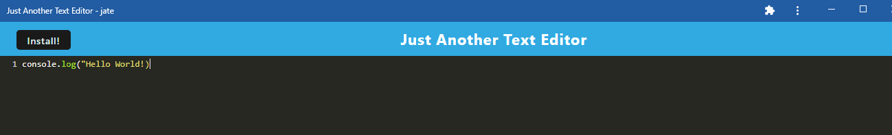

# Text_Editor
A text editor that runs in the browser that will also function offline.

  
## Description
My motivation for this project was to create an app that you can install offline so that you can work on typing code when you don't have access to internet. 
## Table of Contents

- [Installation](#installation)
- [Usage](#usage)
- [Credits](#credits)
- [License](#license)

## Installation

To install Just Another Text Editor, simply push the install button at the top of the app. 

## Usage

To use and work on the project, use VS code, npm install webpack, and express.

    

## Questions

Please reach out to me on my [GitHub](github.com/wolaki96) or my email at wolaki96@gmail.com if you have any questions!

